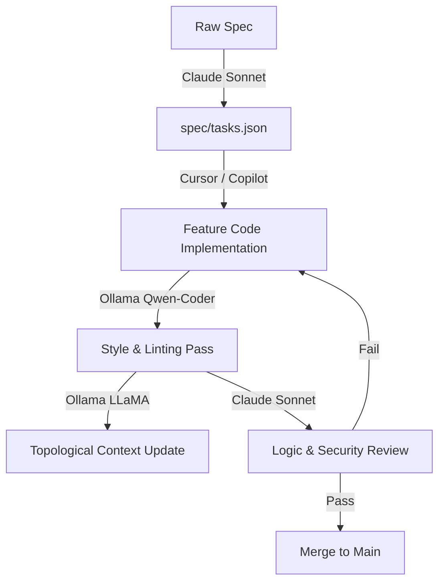

# Multi-Agent Fleet Configuration & Model Routing (`AGENTS.md`)

## 1. Executive Summary & Design Principles

This configuration establishes a production-grade **heterogeneous multi-agent fleet** optimized for spec-driven software engineering. Grounded in multi-agent systems research, this setup operates on two foundational principles:

1. **Task Skills & Procedural Contracts (Over Personas):** Moving away from identity roleplay (e.g., `@Dev`, `@Critic`), agents operate using deterministic **procedural task skills**—explicit step-by-step instructions, defined input/output contracts, and rigid quality gates.
2. **Tiered Model Routing:** Routing high-reasoning tasks to frontier models while offloading high-throughput, routine tasks to local open-source models (via Ollama) to eliminate API costs and ensure data privacy.

---

## 2. Fleet Architecture & Tier Allocation

| Agent Role | Model Backend / Tool | Execution Mode | Key Responsibilities |
| :--- | :--- | :--- | :--- |
| **1. Planner & Architect** | **Claude 3.5 Sonnet / Claude Code** | Interactive / CLI | Requirement decomposition, system design, API contracts. |
| **2. Feature Developer** | **Cursor / GitHub Copilot** | IDE Interactive | Hands-on coding, inline edits, function implementations. |
| **3. Quality & Style Checker** | **Ollama (`qwen2.5-coder:14b`)** | Local / Background | Static linting, PEP8 formatting, docstring generation. |
| **4. Logic & Security Reviewer**| **Claude 3.5 Sonnet** | Automated Pipeline | Edge-case analysis, security vulnerability scanning, spec verification. |
| **5. Codebase Summarizer** | **Ollama (`llama3.2`)** | Local / Scheduled | Dependency tracking, topological documentation, RAG summaries. |

---

## 3. Procedural Task Skills

### Skill 1: Requirement Decomposition & Spec Planning
* **Assigned Agent:** `Planner & Architect` (Claude 3.5 Sonnet)
* **Input:** Raw user specifications (`spec/feature.md`)
* **Procedural Steps:**
  1. Parse requirement specifications and identify missing acceptance criteria or edge cases.
  2. Break features down into atomic sub-tasks with strict interface definitions.
  3. Generate a structured task graph in JSON format.
* **Output Contract:** `spec/tasks.json`
* **Quality Gate:** All sub-tasks must have measurable pass/fail acceptance criteria and defined module inputs/outputs before proceeding to execution.

---

### Skill 2: Local Static Linting & Style Formatting
* **Assigned Agent:** `Quality & Style Checker` (Ollama - `qwen2.5-coder:14b`)
* **Input:** Target source files or git diffs
* **Procedural Steps:**
  1. Scan code against PEP8 / ESLint style rules.
  2. Format missing docstrings and type annotations.
  3. Output a line-item compliance report.
* **Negative Prompt Constraints:**
  * *Do NOT attempt to refactor business logic or modify architectural design.*
  * *Do NOT flag potential runtime bugs—focus strictly on formatting, syntax, and style rules.*
* **Output Contract:** `reports/style-check.json`

---

### Skill 3: Deep Logic & Security PR Review
* **Assigned Agent:** `Logic & Security Reviewer` (Claude 3.5 Sonnet)
* **Input:** Code diffs (`git diff`), `spec/tasks.json`, and static linting report
* **Procedural Steps:**
  1. Compare implementation diff against the acceptance criteria in `tasks.json`.
  2. Check for null/undefined edge cases, race conditions, and resource leaks.
  3. Perform static security scan (OWASP Top 10, SQL injection, hardcoded secrets).
* **Negative Prompt Constraints:**
  * *Do NOT flag style, indentation, or formatting issues (handled by Tier 3 Local Checker).*
  * *Do NOT flag missing null checks if strict static typing (e.g., TypeScript strict mode) already guarantees non-nullity.*
* **Output Contract:** `reports/review-summary.json`

---

### Skill 4: Topological Documentation & Context Summarization
* **Assigned Agent:** `Codebase Summarizer` (Ollama - `llama3.2`)
* **Input:** Repository file tree and AST dependency graphs
* **Procedural Steps:**
  1. Process code modules in **topological dependency order** (leaf utilities first, higher-level orchestrators last).
  2. Extract function signatures, exported interfaces, and module dependencies.
  3. Update lightweight summary files for local context indexing.
* **Output Contract:** `.context/summary_map.json`

---

## 4. Execution Workflow Example

---

## 5. Getting Started & Integration

1. Save this file as `AGENTS.md` in your repository root.
2. Configure local model endpoints in Ollama: `ollama run qwen2.5-coder:14b`.
3. Reference `AGENTS.md` in your Claude Code or Cursor system prompts to enforce task-scoped routing.
